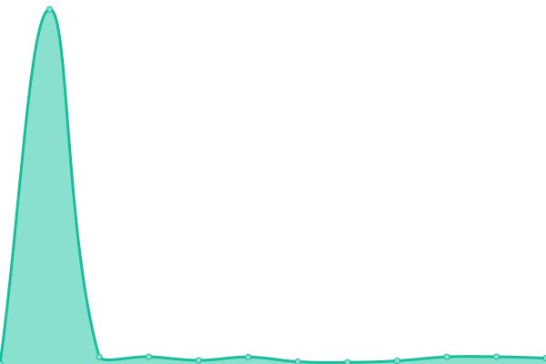

# [📈 Live Status](https://pdsouza.github.io/nw-status-page): <!--live status--> **🟩 All systems operational**

This repository contains the open-source uptime monitor and status page for [Preetam D'Souza](preetam.io), powered by [Upptime](https://github.com/upptime/upptime).

With [Upptime](https://upptime.js.org), you can get your own unlimited and free uptime monitor and status page, powered entirely by a GitHub repository. We use [Issues](https://github.com/pdsouza/nw-status-page/issues) as incident reports, [Actions](https://github.com/pdsouza/nw-status-page/actions) as uptime monitors, and [Pages](https://pdsouza.github.io/nw-status-page) for the status page.

<!--start: status pages-->
<!-- This summary is generated by Upptime (https://github.com/upptime/upptime) -->
<!-- Do not edit this manually, your changes will be overwritten -->
<!-- prettier-ignore -->
| URL | Status | History | Response Time | Uptime |
| --- | ------ | ------- | ------------- | ------ |
|  [Unit API (sandbox)](https://api.s.unit.sh) | 🟩 Up | [unit-api-sandbox.yml](https://github.com/pdsouza/nw-status-page/commits/HEAD/history/unit-api-sandbox.yml) | 

 226ms
     
 | 

<a href="https://pdsouza.github.io/nw-status-page/history/unit-api-sandbox">100.00%</a>
    

|  [Unit API (live)](https://api.unit.co/) | 🟩 Up | [unit-api-live.yml](https://github.com/pdsouza/nw-status-page/commits/HEAD/history/unit-api-live.yml) | 

 139ms
     
 | 

<a href="https://pdsouza.github.io/nw-status-page/history/unit-api-live">100.00%</a>
    

|  [Jackson API (dev)](https://api.devjnptw.com) | 🟩 Up | [jackson-api-dev.yml](https://github.com/pdsouza/nw-status-page/commits/HEAD/history/jackson-api-dev.yml) | 

 199ms
     
 | 

<a href="https://pdsouza.github.io/nw-status-page/history/jackson-api-dev">100.00%</a>
    

<!--end: status pages-->

[**Visit our status website →**](https://pdsouza.github.io/nw-status-page)

## 📄 License

- Powered by: [Upptime](https://github.com/upptime/upptime)
- Code: [MIT](./LICENSE) © [Preetam D'Souza](preetam.io)
- Data in the `./history` directory: [Open Database License](https://opendatacommons.org/licenses/odbl/1-0/)
